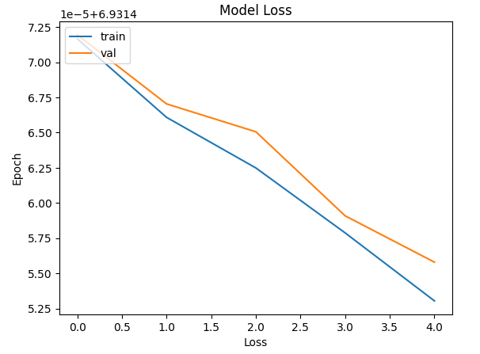
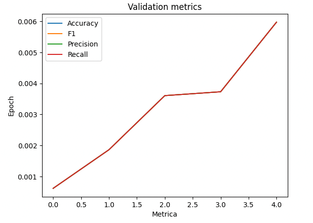
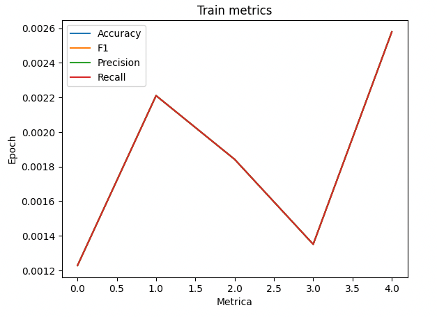

# Stanford Casrs problem

3D object representations are valuable resources for multi-view object class detection and scene understanding. Fine-grained recognition is a growing subfield of computer vision that has many real-world applications on distinguishing subtle appearances differences. This cars dataset contains great training and testing sets for forming models that can tell cars from one another. Data originated from Stanford University AI Lab (specific reference below in Acknowledgment section).

[Dataset](https://www.kaggle.com/datasets/jessicali9530/stanford-cars-dataset/)

## Architecture
### [Adaptive Smooth Optimizer](https://paperswithcode.com/method/adasmooth)

### [MobileNetV1](https://paperswithcode.com/method/mobilenetv1)

## Metrics

### Loss

### Validation

### Train

